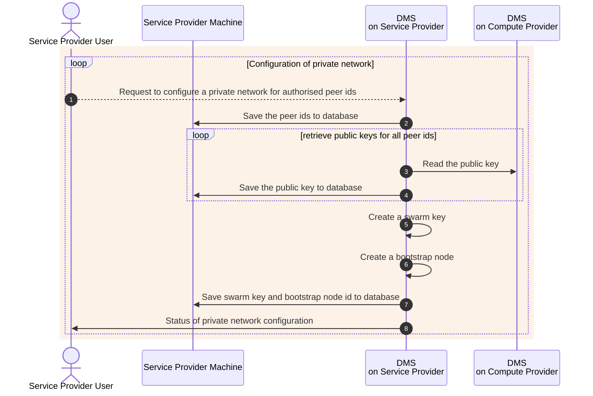
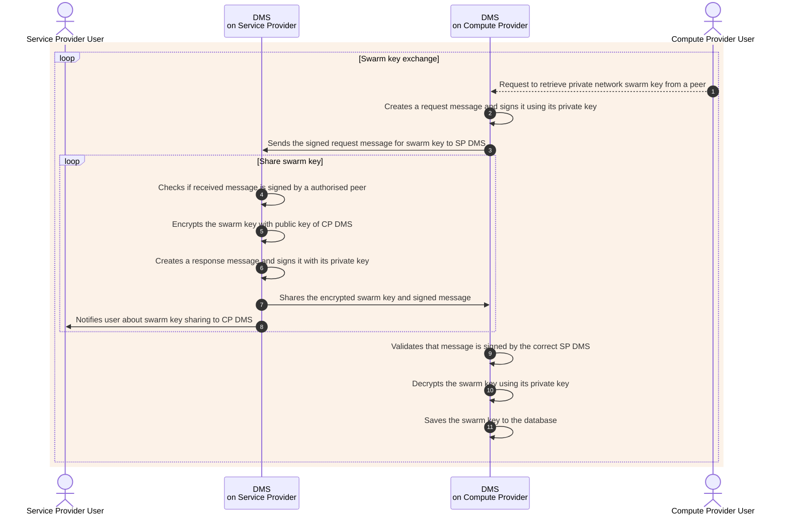
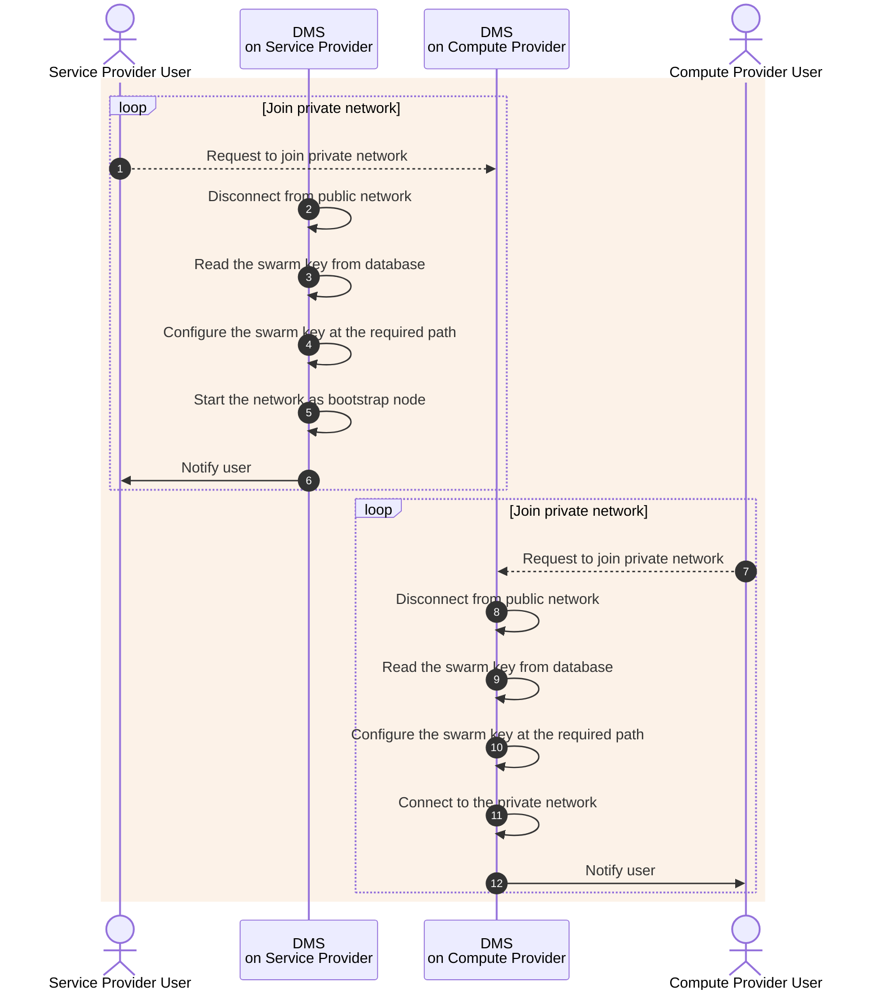
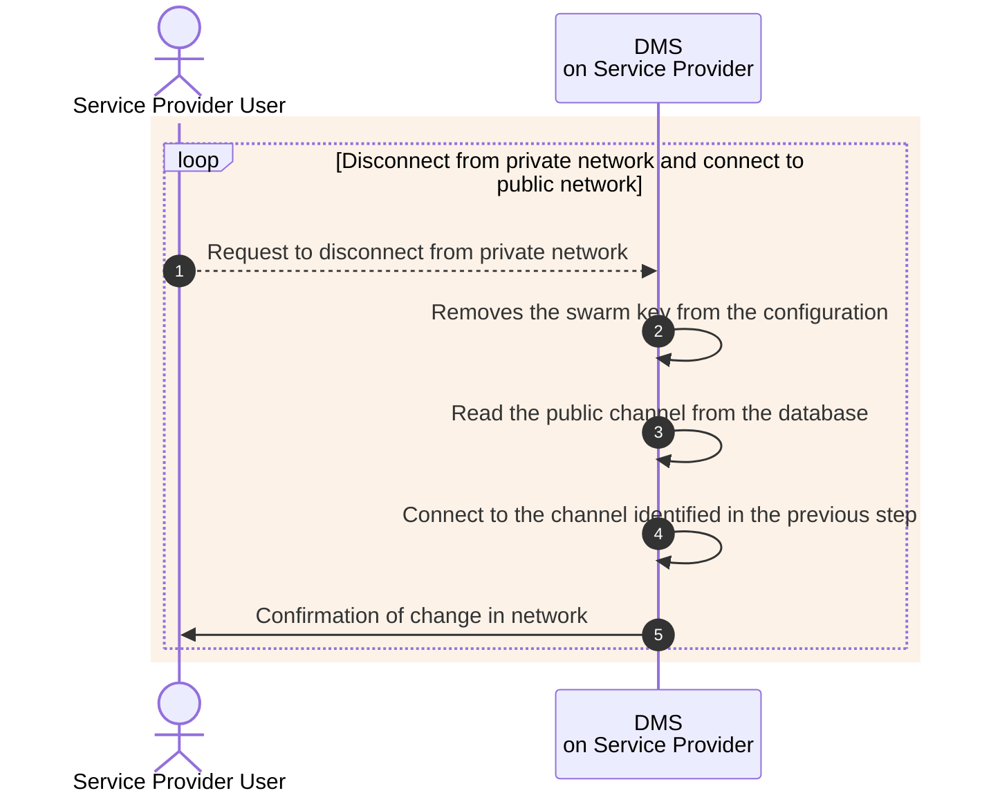
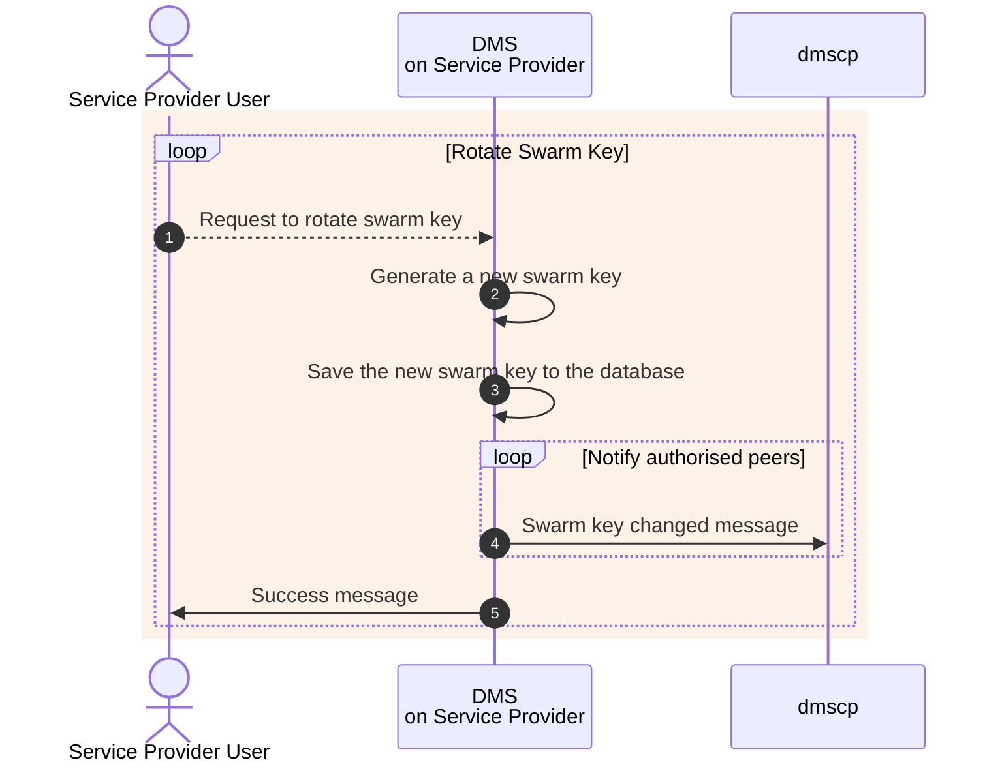

# network

- [Project README](https://gitlab.com/nunet/device-management-service/-/blob/develop/README.md)
- [Release/Build Status](https://gitlab.com/nunet/device-management-service/-/releases)
- [Changelog](https://gitlab.com/nunet/device-management-service/-/blob/develop/CHANGELOG.md)
- [License](https://www.apache.org/licenses/LICENSE-2.0.txt)
- [Contribution guidelines](https://gitlab.com/nunet/device-management-service/-/blob/develop/CONTRIBUTING.md)
- [Code of conduct](https://gitlab.com/nunet/device-management-service/-/blob/develop/CODE_OF_CONDUCT.md)
- [Secure coding guidelines](https://gitlab.com/nunet/documentation/-/wikis/secure-coding-guidelines)

## Table of Contents

1. [Description](#1-description)
2. [Structure and organisation](#2-structure-and-organisation)
3. [Class Diagram](#3-class-diagram)
4. [Functionality](#4-functionality)
5. [Data Types](#5-data-types)
6. [Testing](#6-testing)
7. [Proposed Functionality/Requirements](#7-proposed-functionality--requirements)
8. [References](#8-references)

## Specification

### 1. Description

This package contains all network related code such as p2p communication, ip over libp2p and other networks that might be needed in the future.

### 2. Structure and organisation

Here is quick overview of the contents of this pacakge:

* [README](https://gitlab.com/nunet/device-management-service/-/tree/develop/network/README.md): Current file which is aimed towards developers who wish to use and modify the package functionality.

* [network](https://gitlab.com/nunet/device-management-service/-/tree/develop/network/network.go): This file defines Network and Messenger interfaces and a method to create a new network.

* [types](https://gitlab.com/nunet/device-management-service/-/tree/develop/network/types.go): This file defines the VPN interface. 

* [libp2p](https://gitlab.com/nunet/device-management-service/-/tree/develop/network/libp2p): This contains code related to libp2p functionality.

* [specs](https://gitlab.com/nunet/device-management-service/-/tree/develop/network/specs): This contains class diagram of the package built in plantuml.

### 3. Class Diagram

The class diagram for the network package is shown below.

#### Source file

[network Class Diagram](https://gitlab.com/nunet/device-management-service/-/blob/develop/network/specs/class_diagram.puml)

#### Rendered from source file

```plantuml
!$rootUrlGitlab = "https://gitlab.com/nunet/device-management-service/-/raw/develop"
!$packageRelativePath = "/network"
!$packageUrlGitlab = $rootUrlGitlab + $packageRelativePath
 
!include $packageUrlGitlab/specs/class_diagram.puml
```

### 4. Functionality

`TBD`

**Note: the functionality of DMS is being currently developed. See the [proposed](#6-proposed-functionality--requirements) section for the suggested design of interfaces and methods.**

### 5. Data Types

`TBD`

**Note: the functionality of DMS is being currently developed. See the [proposed](#6-proposed-functionality--requirements) section for the suggested data types.**

### 6. Testing

`TBD`

### 7. Proposed Functionality / Requirements 

#### List of issues

All issues that are related to the implementation of `network` package can be found below. These include any proposals for modifications to the package or new data structures needed to cover the requirements of other packages.

- [network package implementation](https://gitlab.com/groups/nunet/-/issues/?sort=created_date&state=opened&label_name%5B%5D=collaboration_group_24%3A%3A39&first_page_size=20)

#### Interfaces and methods

##### `proposed` Network interface

```go
// Network defines an interface provided by DMS to be implemented by various
// network providers. This could be libp2p, or other p2p providers.
type Network interface {
	// Config sets the configuration for the network in
	Config() error

	// Init initializes the node with config specific in Config() phase.
	// tags: Start
	Init() error

	// EventRegister sets handlers to handle events such as change of local address
	EventRegister() error

	// Dial connects to a peer
	// tags: ConnectPeer
	Dial() error

	// Listen listens on a connection. Example could be a stream for libp2p connection.
	Listen() error

	// Status returns status of current host in regards to implementation.
	// Output must follow a generic struct.
	Status() bool

	// Tears down network interface.
	Stop() error
}
```

Let's have a look at the methods and rationale behind them:

1. `Config()`:

`Config` is where host is prepared with desired settings. Settings are loaded from the file if required. An example in libp2p implementation would be to configure parameters which needs to be passed to `libp2p.New()` method, it can also a good place to set the stream handlers.

Things like private network are configured at this point.

2. `Init()`:

`Init` or `Start` starts up the host. This is a good place to start discovery and starting goroutines for fetching DHT update and updating peerstore.

3. `EventRegister()`:

In libp2p, we can listen to specific events. `EventRegister` is to set handler to such event. A few events in libp2p are:

- EvtLocalAddressesUpdated
- EvtLocalReachabilityChanged
- EvtPeerIdentificationCompleted
- EvtNATDeviceTypeChanged
- EvtPeerConnectednessChanged

More events can be found [here](https://github.com/libp2p/go-libp2p/tree/master/core/event)

4. `Dial()`:

`Dial` is for connecting to a peer. When peer A dials peer B, peer B has to `Listen` to the incoming connection.

5. `Listen()`: 

`Listen` is the counterpart to `Dial`. Read more about listening and dialing [here](https://docs.libp2p.io/concepts/transports/listen-and-dial/)

6. `Status()`:

`TBD`

- All peers we are corrently connected to.
- ??

7. `Stop()`: 

Basically it's like shutting down the peer. It is opposite of `Init` or `Start`.

##### `proposed` VPN interface

```go
type VPN interface {
	// Start takes in an initial routing table and starts the VPN.
	Start() error

	// AddPeer is for adding the peers after the VPN has been started.
	// This should also update the routing table with the new peer.
	AddPeer() error

	// RemovePeer is oppisite of AddPeer. It should also update the routing table.
	RemovePeer() error

	// Stop tears down the VPN.
	Stop() error
}
```

Let's have a look at the methods and background behind them:

`TBD`: Parameter are still to be defined. Should we pass the peer ID? Or make it more generic to have IP addresses?

1. `Start()`:

`Start()` takes in initial list of hosts and assigns each peer a private IP.

2. `AddPeer()`:

`AddPeer()` is for adding a new peer to the VPN after the VPN is created. This should also update the routing table with the new peer. It should also not affect the existing peers, and should not lead to any IP collision.

3. `RemovePeer()`:

`RemovePeer()` should remove a peer from remove peers from the private network.

4. `Stop()`:

`TBD`: What should be done when the VPN is stopped? Should all the peers be removed from the network?

##### `proposed` Internal APIs

1. `publishJob`

* signature: `publishJob(dms.orchestrator.BidRequest)` <br/>

* input: `Bid request` <br/>

* output: None

`publishJob` is responsible for publishing a request for bid to the network for a job received by the DMS. 

2. There should be a top level package for set of functions/initlializers for management of:

- TUN/TAP device
- Virtual ethernet
- Virtual switch
- Firewall management

##### `proposed` sendLibP2PMessage

`sendLibP2PMessage` shall be called by `dms.orchestrator.sendMessage()` function ito send the `telemetry.Message` object via libP2P interface defined in `network` package. It is a low level implementation of sending messages in NuNet network via libp2p. 

##### `proposed` receiveLibP2PMessage

`TBD`

##### `proposed` processMessage

`TBD`


#### `proposed` Private Swarm
**Note: Private Swarm functionality is expected to be moved to libp2p sub-package once specific methods and interfaces have been defined**

The private swarm functionality allows users to create and join a private network with some authorised peers. Note that these peers need to be identified beforehand to use this feature. It is also required that all peers have onboarded to the Nunet network and are using the same channel. It is because the identification of peers is done using libp2p public key generated during the onboarding process.

The creation of private network consists of the following operations.

##### Configure Private Network

The user who wants to create the private network should have a list of `peer ids` it wants to authorise to join the private network. This process configures the network by creating a swarm key and a bootstrap node.



##### Exchange Swarm Key 
The authorised user who wants to connect to the private network will request for a swarm key from the node that has configured the private network. The node which has created the swarm key shares it with the authorised user when requested. The authentication of the user is based on its public key.



##### Join Private Network
The DMS will disconnect from the public network and join the private network using the shared swarm key.



##### Disconnect Private Network
The DMS will disconnect from the private network and join the public network the user onboarded on to.



##### Rotate Swarm Key
The DMS will generate a new swarm key for the private network and notify the authorised users.



### 8. References

- https://github.com/libp2p/go-libp2p/tree/master/core/event 
- https://docs.libp2p.io/concepts/transports/listen-and-dial/ 

